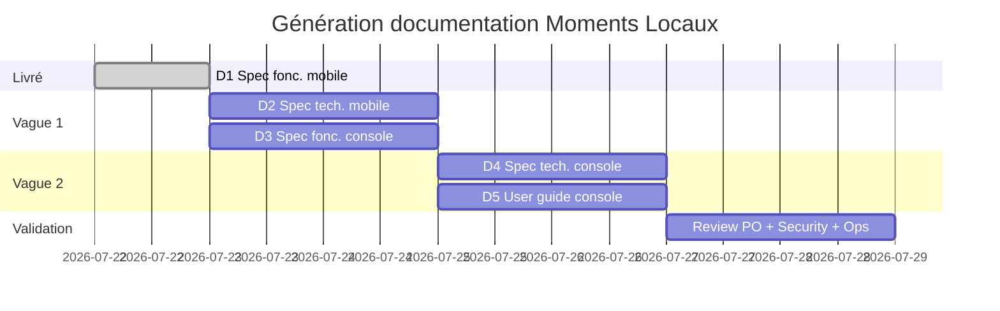

# Plan de documentation produit — Moments Locaux

| Métadonnée | Valeur |
|---|---|
| **Version** | 1.0 |
| **Date** | 2026-07-22 |
| **Objectif** | Suivre la génération des spécifications et guides produit / technique |

---

## 1. Cartographie des documents

| # | Document | Audience | Repo cible | Statut |
|---|---|---|---|---|
| D1 | Spécification fonctionnelle — Application mobile | PO, UX, QA, métier | `mobileApp` | **Livré** → `docs/SPEC_FONCTIONNELLE_APPLICATION_MOBILE.md` |
| D2 | Spécification technique — Application mobile | Mobile eng., QA tech, security | `mobileApp` | **Livré** → `docs/SPEC_TECHNIQUE_APPLICATION_MOBILE.md` |
| D3 | Spécification fonctionnelle — Console d’administration | PO, ops, QA, modérateurs (référentiel) | `Moderation-WebConsole` | **Livré** → `docs/SPEC_FONCTIONNELLE_CONSOLE_ADMIN.md` |
| D4 | Spécification technique — Console d’administration | Front eng., security, DevOps | `Moderation-WebConsole` | **Livré** → `docs/SPEC_TECHNIQUE_CONSOLE_ADMIN.md` |
| D5 | User Guide — Console d’administration | Modérateurs / admins opérationnels | `Moderation-WebConsole` | **Livré** → `docs/USER_GUIDE_CONSOLE_ADMIN.md` |

**Ordre de génération** : D2 → D3 → D4 → D5 (terminé).

**Avancement** : D1–D5 **livrés** (2026-07-23). Suite : review humaine + captures UAT pour D5.

---

## 2. Conventions communes

Pour chaque document :

- **Langue** : français (termes techniques anglais acceptés : RLS, Edge Function, JWT…).
- **Versioning** : `MAJOR.MINOR` + date + historique en bas de fichier.
- **Traçabilité** : section « Sources » (chemins code, ADR, tickets).
- **Périmètre MVP vs post-MVP** : toujours explicite (surtout Lumo / Discovery / Concours).
- **Pas de secrets** : aucune clé, URL privée sensible, service role.
- **Format** : Markdown dans le repo ; export PDF/DOCX optionnel en phase de diffusion.

Structure type d’une **spécification** :

1. Objet / audience / hors-scope  
2. Contexte produit  
3. Corps (fonctionnel **ou** technique)  
4. Exigences / NFR  
5. Matrice d’acceptance ou checklists  
6. Documents liés + glossaire + historique  

Structure type d’un **user guide** :

1. Prérequis d’accès  
2. Premiers pas  
3. Parcours par module (pas à pas)  
4. FAQ / erreurs courantes  
5. Glossaire ops  

---

## 3. D2 — Spécification technique application mobile

### 3.1 Objectif

Décrire **comment** le mobile est construit et intègre Supabase / Mapbox / push, pour permettre maintenance, onboarding eng. et audits sécurité.

### 3.2 Emplacement proposé

`mobileApp/docs/SPEC_TECHNIQUE_APPLICATION_MOBILE.md`

### 3.3 Sommaire détaillé prévu

1. **Stack & runtime**  
   Expo SDK, RN, TypeScript, Expo Router, Mapbox, Sentry, schémas URL `momentslocaux://`
2. **Architecture applicative**  
   `app/` (routes), `src/services`, `src/state`, feature flags (`src/config/*.flags.ts`), data provider Supabase
3. **Auth & session**  
   Supabase Auth, OAuth deep links, biométrie, GuestGate, stores auth actifs vs legacy
4. **Couche données**  
   Tables touchées, RLS attendues (réf. audits), Edge Functions (`event-checkin`, `delete-account`, `push-dispatch`, discovery*)
5. **Modules techniques par domaine**  
   Events CRUD & statuts, map/bbox, social, check-in, reports, notifications/push/preferences, media upload
6. **Feature flags & build variants**  
   Gamification / Discovery / Contests ; env DEV/UAT/PROD ; variables `EXPO_PUBLIC_*`
7. **Sécurité & privacy**  
   Pas de service role mobile, permissions OS, suppression compte, Sentry scrubbing
8. **Observabilité & qualité**  
   `typecheck`, `lint`, matrices QA, runbooks (`infra/`, `docs/notifications/`)
9. **Diagrammes**  
   Séquence soumission event → pending → publish ; séquence check-in ; push dispatch
10. **Annexes**  
    Inventaire services, routes gardées, dette technique connue (stores dupliqués, legacy screens)

### 3.4 Sources à lire avant rédaction

- `MVP_SCOPE.md`, ADR 001/002  
- Audits Wave 1–2 (auth, event lifecycle, RLS, media, map, build)  
- `docs/MAP_SCREEN_ORCHESTRATION.md`, `docs/notifications/CHANNELS.md`, `docs/GIT_AND_ENVIRONMENTS.md`  
- `supabase/` (migrations / diagnostics — description, sans appliquer)  
- D1 (spec fonctionnelle) pour alignement vocabulaire

### 3.5 Estimation & critères de done

| Critère | Done quand… |
|---|---|
| Couverture | Chaque parcours MVP de D1 a un paragraphe « implémentation » |
| Sécurité | Section RLS / Edge / secrets complète |
| Ops | Procédure env + flags documentée |
| Review | Relu Mobile Reliability + Supabase Security Architect |

**Effort indicatif** : 1–1,5 j agent + 0,5 j review humaine.

---

## 4. D3 — Spécification fonctionnelle Console d’administration

### 4.1 Objectif

Décrire les **capacités métier** de la console pour ops / PO / QA : files, actions, statuts, rôles, bascule d’environnement, backlog Lumo.

### 4.2 Emplacement proposé

`MomentsLocaux---Moderation-WebConsole/docs/SPEC_FONCTIONNELLE_CONSOLE_ADMIN.md`

### 4.3 Sommaire détaillé prévu

1. Vision & personas (modérateur, admin, support bugs)  
2. Périmètre actuel vs tickets Lumo (`GAMIFICATION_ADMIN_TICKETS.md`)  
3. Accès & rôles (`profiles.role` ∈ `moderateur` | `admin`)  
4. Bascule DEV ↔ UAT (comportement fonctionnel, sessions isolées)  
5. Modules :  
   - Dashboard (KPIs, backlog, deep links filtrés)  
   - Événements (liste, détail, bulk approve/refuse, archive, motif, QR à publish)  
   - Commentaires signalés (remove)  
   - Photos / media submissions (approve → `event_media`, reject)  
   - Signalements (clôture, filtres sévérité / type)  
   - Utilisateurs (ban / lift ; warn = service sans UI à date)  
   - Concours (CRUD, entries, podium, jury)  
   - Partenaires Lumo & rewards (CRUD)  
   - Bugs (triage, CSV import, bulk)  
6. Machines d’états (events, reports, media, contests, bugs, profiles)  
7. Side-effects attendus (audit `moderation_actions`, notifications utilisateur)  
8. Règles métier (ex. reward active ⇒ partenaire actif ; publish ⇒ QR)  
9. Matrice d’acceptance ops (reprendre / étendre le runbook README)  
10. Écarts connus (warn UI manquante, Pass redemption non livré, hooks Lumo 004/005)

### 4.4 Sources

- README console, `GAMIFICATION_ADMIN_TICKETS.md`  
- `src/pages/**`, `src/api/moderation.service.ts`, `gamification.service.ts`  
- ADR 001 (frontière mobile ↔ admin)  
- D1 §12 (interactions cross-app)

### 4.5 Estimation & done

**Effort** : ~1 j agent + review PO/ops.  
**Done** : chaque route `/moderation/*` documentée + transitions de statut + hors-scope Lumo explicite.

---

## 5. D4 — Spécification technique Console d’administration

### 5.1 Objectif

Documenter stack, authz front, clients Supabase multi-env, services API, storage, contraintes RLS, scripts ops.

### 5.2 Emplacement proposé

`MomentsLocaux---Moderation-WebConsole/docs/SPEC_TECHNIQUE_CONSOLE_ADMIN.md`

### 5.3 Sommaire détaillé prévu

1. Stack : Vite 7, React 19, TS, react-router 7, Tailwind 4, Supabase JS  
2. Bootstrap : `EnvironmentProvider` → `AuthProvider key={env}` → routes  
3. Multi-env : `VITE_SUPABASE_*_DEV/_UAT`, `localStorage` target env, storageKey session par env  
4. Authz : `ensureModeratorAccess`, `RequireAuth` / `PublicOnly`  
5. Couche API : catalogue méthodes `ModerationService` + `GamificationService`  
6. Schéma / tables touchées + Storage `contest-media`  
7. Audit & notifications : `logAction`, `sendNotification`, side-effects UI (`moderationFeedback`)  
8. Sécurité : anon key only, dépendance RLS, pas de distinction UI admin vs modo  
9. Build / lint / scripts `scripts/check_*.js`  
10. Gaps techniques (types incomplets, `warnUser` sans UI, tickets RPC Lumo)  
11. Diagrammes : login+role check ; approve event (status + QR + audit + notif)

### 5.4 Sources

- `src/main.tsx`, `App.tsx`, `api/*`, `contexts/*`  
- `.env.example`, `.env.uat.example`  
- Migrations / RPC côté `mobileApp/supabase` référencées par tickets Lumo (sans les appliquer)  
- Advisors / diagnostics si disponibles

### 5.5 Estimation & done

**Effort** : ~0,75–1 j.  
**Done** : un ingénieur peut reproduire setup local + comprendre chaque mutation critique sans lire tout le code.

---

## 6. D5 — User Guide Console d’administration

### 6.1 Objectif

Guide **opérationnel** pour un modérateur : comment faire le travail au quotidien, sans jargon d’architecture.

### 6.2 Emplacement proposé

`MomentsLocaux---Moderation-WebConsole/docs/USER_GUIDE_CONSOLE_ADMIN.md`  
Option diffusion : export PDF pour onboarding ops.

### 6.3 Sommaire détaillé prévu

1. **Avant de commencer** : compte requis, rôles, choix DEV vs UAT, URL login  
2. **Tour de la sidebar** : à quoi sert chaque menu  
3. **Routine quotidienne recommandée**  
   1. Dashboard — lire le backlog  
   2. Événements pending — approuver / refuser (avec motif clair)  
   3. Photos pending  
   4. Signalements & commentaires  
   5. Bugs critiques  
4. **Fiches pas-à-pas** (captures à ajouter en phase 2)  
   - Approuver un événement  
   - Refuser avec motif (impact mobile créateur)  
   - Archiver  
   - Traiter un report  
   - Bannir / réactiver un utilisateur  
   - Modérer une photo  
   - Créer / clôturer un concours + podium  
   - Gérer un partenaire et ses rewards  
   - Importer / trier des bugs  
5. **Bonnes pratiques** : formulation des motifs de refus, sévérité reports, quand escalader  
6. **Erreurs fréquentes** : rôle insuffisant, RLS deny, mauvais environnement, session expirée  
7. **Ce que la console ne fait pas encore** : Pass redemption, config Lumo rules, warn UI, analytics Lumo  
8. **Support** : qui contacter, où logger un incident

### 6.4 Sources

- D3 (spec fonctionnelle) comme source de vérité  
- README runbook  
- Retours ops (à collecter en review)

### 6.5 Estimation & done

**Effort** : ~0,75 j rédaction + 0,5 j captures d’écran (humain ou session navigateur).  
**Done** : un nouveau modérateur traite un event pending et un report sans aide eng.

---

## 7. Planning proposé

| Vague | Documents | Dépendances |
|---|---|---|
| **0 — Fait** | D1 | Inventaires reverse-engineering |
| **1 — Fait** | D2 + D3 | D1 |
| **2 — Fait** | D4 + D5 | D3 |
| **3** | Review croisée + captures User Guide | D1–D5 |

---

## 8. Matrice de responsabilités (revue)

| Rôle | D1 | D2 | D3 | D4 | D5 |
|---|---|---|---|---|---|
| Product Owner MVP | A | C | A | C | A |
| UX/UI Guardian | C | I | C | I | C |
| Mobile Reliability | C | A | I | I | I |
| Supabase Security | C | A | C | A | I |
| QA Lead | C | C | A | C | A |
| Ops / Modération | I | I | A | C | A |
| Release Manager | I | C | I | C | I |

*A = Accountable (validation) · C = Contributor · I = Informed*

---

## 9. Risques & mitigations

| Risque | Impact | Mitigation |
|---|---|---|
| Drift code ↔ doc | Doc obsolète | Bannière « vivant » + MAJ à chaque ticket scope |
| Confusion MVP / flags | Fausse couverture store | Sections « Hors MVP » obligatoires |
| Secrets dans la doc | Fuite | Revue security ; exemples `.env.example` only |
| User Guide sans captures | Adoption faible | Phase 2 screenshots sur UAT |
| Tickets Lumo en cours | Spec admin incomplète | Marquer « prévu / partiel / livré » par module |

---

## 10. Prochaine action recommandée

1. **Review croisée** D1–D5 (PO, Ops, Mobile Reliability, Security).  
2. **Captures UAT** pour illustrer D5 (emplacements `[Capture]` dans le guide).  
3. Export PDF optionnel du User Guide pour onboarding modo.

---

## 11. Historique

| Version | Date | Notes |
|---|---|---|
| 1.0 | 2026-07-22 | Plan initial après reverse-engineering des deux repos ; D1 livré |
| 1.1 | 2026-07-23 | D2 + D3 livrés ; prochaine vague D4 + D5 |
| 1.2 | 2026-07-23 | D4 + D5 livrés ; corpus documentaire initial complet |
