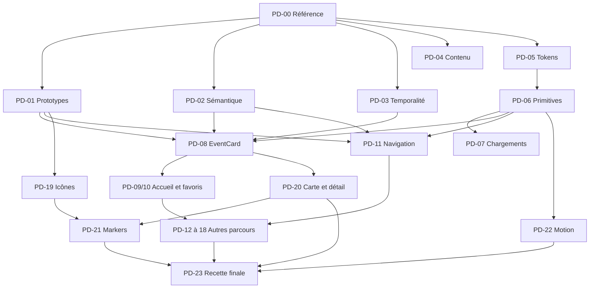

# Moments Locaux — Plan d’implémentation Product Design v2

Date : 8 septembre 2026. Statut : plan proposé, implémentation non démarrée.

Ticket de cette mission documentaire : **MVP-P1-007 — plan de mise à niveau Product Design**. Branche : `docs/product-design-upgrade-plan`.

Source : [Global Product Design Review — analyse et dix captures](../../audits/standalone-audits/GLOBAL_PRODUCT_DESIGN_REVIEW_2026-09-08.md).

## 1. Résultat attendu

Faire évoluer l’Alpha vers une expérience identifiable comme Moments Locaux, où l’utilisateur comprend rapidement **ce qui se passe, quand et où**, puis peut enregistrer, explorer et contribuer sans ambiguïté.

Le territoire proposé est **« Les affiches du coin »** : photographie documentaire, fenêtre asymétrique, trait et point dérivés du logo, ligne temporelle lisible, repères cartographiques cohérents et mouvement bref d’apparition. Cette direction devient une spécification à prototyper ; elle n’est pas considérée comme approuvée par la seule existence de l’audit.

La progression porte sur quatre résultats :

1. Corriger les défauts visibles : contrastes, textes, commandes masquées, temporalité ambiguë et chargements incohérents.
2. Établir les composants partagés qui évitent de reproduire ces défauts.
3. Migrer les parcours Alpha par ensembles cohérents, en conservant leurs comportements utiles.
4. Ajouter les signatures graphiques et cartographiques après validation de leur lisibilité et de leur coût.

Le présent document constitue le backlog local de cette mise à niveau. Les identifiants **PD-00 à PD-24** sont proposés ici ; ils ne représentent pas des tickets créés dans un outil externe. Tous sont à faire. Aucun ticket applicatif n’est clôturé par ce plan.

## 2. Périmètre, références et règles d’exécution

Références qui prévalent sur les recommandations de design :

- [ADR 001 — administration web](../decisions/ADR_001_ADMIN_MODERATION_WEB_APP.md).
- [ADR 002 — scope mobile et amendement Alpha](../decisions/ADR_002_MOBILE_MVP_SCOPE.md).
- [MVP Scope](../../MVP_SCOPE.md).
- [MVP Tickets](MVP_TICKETS.md), [P0 Blockers](P0_BLOCKERS.md) et [MVP Action Plan](MVP_ACTION_PLAN.md).
- [Charter UI Surfaces](../../docs/CHARTER_UI_SURFACES.md) et [règle Cursor associée](../../.cursor/rules/charter-ui-surfaces.mdc).

### Inclus

Accueil, cartes événement, recherche, filtres, carte, aperçu, détail, favoris, membres et suivis, propositions et historique, contribution depuis une affiche, corrections, historique des contributions, notifications et préférences, auth et onboarding, profil, réglages, support, signalements, chat et tour Lumia.

### Limites

- Aucune réintroduction de création organisateur, modération mobile, check-in, offres, gamification ou Discovery Engine archivé.
- Les propositions Alpha et le chat Lumia restent dans le périmètre ; ils ne doivent pas être confondus avec le Discovery Engine V2.
- Aucune migration, modification de fichier backend ou transformation de données utilisateur dans les tickets UI. Un besoin de données manquantes produit un ticket distinct du périmètre Security Architect ; aucune migration n’est appliquée sans validation humaine.
- Aucun retrait automatique de suivis, favoris ou contributions à l’occasion d’une migration visuelle.
- Pas de changement d’API publique, de route ou de statut serveur uniquement pour changer un libellé.
- Pas de suppression de fichiers existants dans ce programme sans demande explicite justifiée par un ticket. Retirer un élément visible signifie d’abord ne plus le rendre, après remplacement de sa fonction.
- Le programme design ne remplace pas les P0 de publication. Leur état doit être vérifié avant une release ; l’audit ne prouve pas qu’ils sont résolus.

### Articulation avec le backlog existant

| Rattachement | Usage dans ce plan |
|---|---|
| MVP-P1-007 | Corrections et cohérence visible ; les refontes sont suivies séparément sous PD-* |
| MVP-P2-002 | Accessibilité approfondie ; l’accessibilité des composants modifiés est obligatoire dès chaque ticket |
| MVP-P1-009 | Cohérence inbox, ressources indisponibles et navigation des notifications, en respectant le push inclus dans l’Alpha |
| MVP-P1-010 | Réutiliser le principe de motif de refus dans les contributions Alpha, sans restaurer les écrans organisateur |
| P0 scope, lifecycle et release | Invariants de non-régression ; aucune clôture implicite |

Une branche, un diff et une review par ticket. Convention future : `fix/pd-04-content`, `feat/pd-08-event-card`, etc. Les tickets L peuvent être subdivisés en sous-tickets indépendants avant exécution ; éviter une PR contenant toute une vague.

## 3. Décisions à préparer, sans bloquer les corrections indépendantes

La validation intervient sur un livrable concret. Les demandes ci-dessous concernent les choix produit ou visuels, pas une permission supplémentaire pour rédiger ce plan ou corriger un contraste.

| Décision | Recommandation de départ | Livrable pour décider | Responsable | Travail dépendant | Solution si la décision attend |
|---|---|---|---|---|---|
| D1 — territoire graphique | Les affiches du coin, dérivé du logo | Accueil, favoris, état vide et aperçu cartographique avec les mêmes contenus | Product Owner + UX/UI Guardian | PD-08, PD-19, PD-21 | Corriger couleurs et typographie sans imposer la nouvelle géométrie |
| D2 — aimer / enregistrer / intérêt / suivre | Distinguer explicitement les intentions ; ne pas modifier silencieusement leur couplage | Tableau des effets actuels et deux variantes d’interaction | Product Owner + Mobile Reliability Engineer | Actions de PD-08, PD-10, PD-12, PD-16, PD-19 | Garder les effets actuels avec des libellés fidèles ; aucune conversion des données |
| D3 — navigation et contribution | Découvrir / Carte / Idées / Favoris / Profil ; hub Profil et contribution explicite | Prototype cliquable, inventaire des entrées du FAB/drawer et tâches d’usage | Product Owner + UX/UI Guardian | PD-11 et déplacement des suivis dans PD-12 | Ajouter les labels et corriger les chevauchements dans la navigation actuelle |
| D4 — temporalité | Distinguer séance, récurrence et disponibilité sur preuve disponible | Cas réels documentés, règles de fallback et exemples avant/après | Product Owner + Mobile Reliability Engineer | PD-03 puis MomentLine et intégrations | Formulation prudente ; aucune séance « aujourd’hui » inventée |
| D5 — moyens techniques et assets | Stack existante ; Expo Image seulement si utile ; PNG Mapbox puis essai 2,5D | Prototype mesuré et delta de poids/mémoire | Mobile Reliability Engineer + UX/UI Guardian | PD-08 pour les médias, PD-21 pour la carte | Image actuelle et markers SVG existants |

Le renommage proposé est « Idées » pour les recommandations et « Mes contributions » pour les envois/corrections. Il ne renomme pas automatiquement les routes `proposals` ou `my-suggestions`.

## 4. Vagues, jalons et durée indicative

Hypothèse de capacité : un développeur RN dédié, un designer disponible régulièrement, QA iOS/Android et intervention ponctuelle d’un artiste 3D. Les tâches design peuvent avancer en parallèle des corrections mobiles. Il s’agit de rôles de projet, pas d’une demande de lancer plusieurs agents.

| Phase | Fenêtre indicative depuis démarrage | Tickets dominants | Résultat livrable |
|---|---|---|---|
| Préparation | Semaine 1 | PD-00, PD-01, PD-02, début PD-03 | Référence mesurée, prototypes, contrats produit et découpage stabilisé |
| Wave 1 — identity / corrections | Semaines 1–3 | PD-03 à PD-07, corrections nav immédiates | Texte, contraste, dates et états d’attente fiables |
| Wave 2 — consistency | Semaines 3–11 | PD-08 à PD-18, PD-20 | Cartes et principaux parcours migrés sur le socle commun |
| Wave 3 — delight | Semaines 10–16 | PD-19, PD-21, PD-22 | Icônes et carte de marque, motion maîtrisé |
| Recette et stabilisation | En continu ; réserve semaines 16–18 | PD-23, corrections issues des recettes | Mise à niveau validée sur appareils représentatifs |
| Wave 4 — polish | Après mesure des vagues précédentes | PD-24 | Options avancées justifiées séparément |

Enveloppe de planification : **environ 12–18 semaines**, selon le niveau retenu pour la carte 2,5D, les décisions et les résultats de recette. Le détail des efforts sera re-chiffré après PD-00/01/02. Ce calendrier n’est ni un engagement ni une addition des fenêtres de l’audit. Une version corrigée peut être livrée avant l’achèvement de la signature cartographique.

### Jalons de sortie

- **J0 — prêt à implémenter :** captures de référence, cas de données et décisions documentés ; premiers tickets indépendants prêts.
- **J1 — correction visible :** paires de couleurs validées, texte cohérent, attente non bloquante, fonctions accessibles malgré le FAB, représentation temporelle prudente.
- **J2 — cœur cohérent :** Accueil, Favoris, aperçu/détail, recherche et navigation passent leurs recettes ; composants communs réellement utilisés.
- **J3 — couverture Alpha :** contribution, idées, social, notifications, auth, réglages et Lumia sont alignés ; aucun parcours perdu.
- **J4 — signature validée :** icônes, motion et éventuelle 2,5D passent les tests d’usage et de performance. Si la 2,5D échoue, livrer la version SVG cohérente et documenter ce choix.

### Chemin critique

Le schéma montre les principales dépendances entre lots ; les prérequis exacts de chaque ticket sont ci-dessous. Une validation d’accessibilité ou de performance défaillante bloque la livraison du ticket concerné dès son propre jalon.

## 5. Backlog exécutable

Efforts de réalisation indicatifs : **S = jusqu’à 1 jour**, **M = 2–3 jours**, **L = 4–5 jours** de travail principal, hors attente de décision et QA transverse. Une tâche plus grande doit être découpée. Les fichiers indiqués sont existants sauf mention « nouveau » ; leur contenu sera re-vérifié au démarrage du ticket.

### PD-00 — Établir la référence visuelle et les scénarios

- **Responsable :** QA Lead + UX/UI Guardian. **Effort :** M. **Dépendances :** aucune. **Source audit :** N, limites.
- **Travail :** reprendre les dix écrans de l’audit, capturer les surfaces manquantes (carte, détail, recherche, inscription, sheets, erreurs, Lumia), noter build, plateforme, taille d’écran, échelle de texte et état des données.
- **Livrables :** dossier de captures de recette hors données privées ; matrice des états ; relevé initial des temps de frame, poids de build et mémoire sur liste/carte.
- **Fichiers :** ce plan ; futur dossier `audits/product-design-v2/` (nouveau, à créer lors du ticket).
- **Acceptation :** chaque surface possède un état normal et les états pertinents loading/empty/error/guest ; les captures de l’audit restent des preuves historiques ; appareils et scénarios de performance sont reproductibles.
- **Vérification :** revue de la matrice et captures iOS/Android. Ne pas créer ou modifier des données distantes pour réaliser cette référence ; utiliser les jeux de données autorisés ou des fixtures locales.

### PD-01 — Valider le vocabulaire propriétaire sur prototype

- **Responsable :** UX/UI Guardian + Product Owner. **Effort :** L. **Dépendance :** PD-00. **Source :** D–G, N. **Décisions :** D1, préparation D3.
- **Travail :** comparer les trois architectures de card avec les mêmes contenus ; dériver cinq signatures du logo ; réaliser Accueil, Favoris, loader/empty et aperçu carte ; tester une navigation avec labels et une entrée de contribution explicite.
- **Livrables :** prototype consultable, variantes retenues, spécification de géométrie et de hiérarchie, liste des décisions avec auteur/date. Support au choix de l’équipe, sans imposer un nouvel outil.
- **Acceptation :** photo, affiche verticale, média absent et titre long fonctionnent ; l’affiche source n’est pas recadrée illisiblement ; le premier événement devient plus lisible sans réduire les cibles tactiles ; D1 est tranchée sur les écrans.
- **Vérification :** tâches qualitatives avec environ cinq utilisateurs, dont profils peu familiers de l’app ; consigner erreurs, hésitations et reconnaissance sans logo. Cet échantillon n’est pas une validation statistique.

### PD-02 — Écrire le contrat des actions et de la navigation

- **Responsable :** Product Owner + Mobile Reliability Engineer. **Effort :** M. **Dépendance :** PD-00 ; prototype PD-01 pour D3. **Source :** A, G, N. **Décisions :** D2, D3.
- **Fichiers à inspecter :** `src/components/events/EventCard.tsx`, `app/(tabs)/favorites.tsx`, `src/screens/proposals/ProposalsScreen.tsx`, `app/(tabs)/_layout.tsx`, `src/utils/contribution-fab.ts` et leurs appels de services existants.
- **Travail :** cartographier chaque tap/swipe et ses effets sur like, favori, intérêt et suivi ; inventorier toutes les destinations FAB/drawer, y compris bug/support ; préciser guest gates, sauvegarde de contexte et accès Lumia.
- **Acceptation :** chaque commande possède intention, libellé, icône, effet, retour d’erreur et état persistant ; décision explicite de conserver ou séparer le couplage actuel ; chaque fonction garde un chemin d’accès.
- **Vérification :** parcours avant/après sur prototype et revue du contrat. Si la séparation exige un changement backend, ouvrir un ticket indépendant ; les corrections visuelles peuvent continuer avec la sémantique actuelle documentée.

### PD-03 — Fiabiliser la présentation temporelle

- **Responsable :** Mobile Reliability Engineer + Product Owner. **Effort :** L. **Dépendance :** PD-00, décision D4. **Source :** A.6, G, N.6/N.9.
- **Fichiers :** `src/utils/event-card-display.ts`, `src/utils/event-card-meta.ts`, `src/utils/filter-events.ts`, `src/utils/search-temporal-choice.ts`, tests associés et premiers consommateurs.
- **Travail :** documenter ce que les champs actuels permettent réellement d’affirmer ; définir un modèle d’affichage partagé, puis raccorder la carte existante avant la refonte.
- **Acceptation :** séance datée, passage de minuit, période longue, récurrence documentée, date absente, événement passé/annulé et fuseau horaire ont une sortie prévue. `00:00–23:59` seul n’est jamais une preuve de récurrence, d’horaire inconnu ou d’ouverture toute la journée.
- **Acceptation :** une période active reste distinguée d’une séance confirmée aujourd’hui ; si les occurrences sont absentes, afficher les dates connues et un fallback explicite. Ne pas fabriquer « prochaine séance » à partir du titre ou de la seule longueur de période.
- **Vérification :** tests unitaires de règles temporelles et filtres existants, limites de jour/changement d’heure, comparaison Accueil/Favoris/Carte. Les changements de filtrage métier dépassant ce contrat sont isolés, pas dissimulés dans un redesign.

### PD-04 — Unifier la voix et les libellés

- **Responsable :** UX/UI Guardian. **Effort :** M. **Dépendances :** PD-00 ; PD-02 pour les noms d’actions. **Source :** G Content, N.
- **Fichiers :** `src/screens/home/HomeScreen.tsx`, écrans `proposals`, `src/screens/profile/MySuggestionsScreen.tsx`, `app/(tabs)/favorites.tsx`, `app/events/suggest-from-poster/index.tsx`, libellés de navigation.
- **Travail :** vouvoiement ; glossaire ; retrait « Roulement de tambour », « meilleurs » non justifié et « pépites » dans les contrôles ; dates d’envoi explicitement nommées ; mention de vérification avant envoi.
- **Acceptation :** mêmes mots pour un même objet sur écran, toast et lecteur d’écran ; recherche des suivis adaptée aux personnes ; « Pour vous » conservé seulement si le mécanisme le justifie ; routes et valeurs de statut inchangées.
- **Vérification :** recherche ciblée des formulations, revue en contexte avec erreurs et pluriels. Ne pas réécrire les textes utilisateur ni renommer les statuts serveur.

### PD-05 — Stabiliser les tokens et la documentation normative

- **Responsable :** UX/UI Guardian + Mobile Reliability Engineer. **Effort :** M. **Dépendance :** PD-00 ; D1 pour les nouvelles formes. **Source :** B, K, M.
- **Fichiers :** `src/constants/theme.ts`, `src/constants/fonts.ts`, `DESIGN.md`, `MOTION_DESIGN.md`, `docs/CHARTER_UI_SURFACES.md`.
- **Travail :** tokens sémantiques foreground/background, contraste texte et contrôles, variantes typographiques explicitement liées aux fontes ; documenter les rôles des rayons et surfaces. Conserver des alias pour les consommateurs non migrés.
- **Acceptation :** blanc sur lime remplacé par Ink ; texte secondaire lisible sur Mist et Soft ; états pressed/disabled et statuts vérifiés ; aucune modification globale de radius sans inventaire des consommateurs ; couleurs de catégorie distinctes préservées.
- **Vérification :** tableau de contrastes calculés sur chaque paire utilisée, captures des composants et des surfaces de la checklist. Les valeurs candidates de l’audit sont testées avant d’être normatives.
- **Limite :** mettre à jour la documentation en indiquant « cible » et « migré » ; ne pas déclarer tous les écrans v2 à ce stade.

### PD-06 — Construire le socle de composants à partir de l’existant

- **Responsable :** Mobile Reliability Engineer. **Effort :** L. **Dépendances :** PD-05, D1 pour la géométrie. **Source :** G, K, L, M.
- **Fichiers :** `src/components/ui/Button.tsx`, `Input.tsx`, `Card.tsx`, `ScreenHeader.tsx`, `AppToast.tsx`, `index.ts` ; primitives Text/Stack/Surface/IconButton à ajouter seulement si utilisées.
- **Travail :** faire évoluer les API existantes avec compatibilité ; prévoir taille de texte, état busy, rôle, icône, variantes et contraintes de surface ; créer une galerie de fixtures locale ou écran de développement non exposé en production.
- **Acceptation :** aucune Surface n’ajoute implicitement border+shadow ; champs avec labels et erreurs persistants ; cibles 48 ; pas de hauteur fixe coupant les textes agrandis ; loader de bouton de la couleur de son texte.
- **Vérification :** galerie iOS/Android normal/grand texte, navigation clavier si pertinente, lecteurs d’écran. Pas de bibliothèque de primitives sans consommateur ni nouvel outil de catalogue obligatoire.

### PD-07 — Corriger les chargements, vides et erreurs communs

- **Responsable :** Mobile Reliability Engineer + UX/UI Guardian. **Effort :** M. **Dépendances :** PD-04/05 ; PD-06 pour les nouveaux contrôles. **Source :** G, J, N.7/N.8.
- **Fichiers :** `DiscoveryLoadingState.tsx`, `EventCardSkeleton.tsx`, `EmptyState.tsx`, `BrandLogoSpinner.tsx`, `MotionReveal.tsx`, Favoris et `ProposalsScreen.tsx`.
- **Travail :** remplacer les panneaux plein écran et la baguette ; garder les données lors des actualisations ; rendre un retry accessible ; une seule annonce de chargement par région.
- **Acceptation :** succès vide, erreur, permission refusée et visiteur sont distingués ; aucune durée artificielle d’attente ; skeleton réservé au premier chargement ; reduced motion et perte de focus arrêtent les boucles.
- **Vérification :** chargement rapide/lent, actualisation, perte réseau, retry, retour sur écran. SVG de marque simple d’abord ; illustrations finales intégrables ensuite via PD-19.

### PD-08 — Implémenter EventCard et son contrat média

- **Responsable :** Mobile Reliability Engineer + UX/UI Guardian. **Effort :** L, à découper si ajout natif. **Dépendances :** PD-01/02/03/05/06. **Source :** F, G, L. **Décision :** D5 pour Expo Image.
- **Fichiers :** `src/components/events/EventCard.tsx`, `EventCardContent.tsx`, `EventCardMetaRows.tsx`, `EventCoverPlaceholder.tsx`, `src/constants/event-card-variants.ts`, `src/components/search/EventResultCard.tsx`, `MapResultCard.tsx`.
- **Travail :** façade commune avec trois variantes éditoriale/compacte/aperçu, média photo/affiche/fallback, ligne temporelle partagée et actions conforme D2. Préserver les adaptateurs d’appel existants.
- **Acceptation :** le titre récupère la largeur du panneau DÉBUT/FIN ; category badge devient discret ; annulation/complet restent visibles ; image manquante et titre long utilisables ; aucune carte complète attend les statistiques sociales pour s’afficher.
- **Acceptation :** l’action principale et les actions secondaires sont accessibles séparément ; un tap secondaire n’ouvre pas le détail ; les retours d’échec restaurent l’état visuel ; pas de carousel lourd par cellule par défaut.
- **Vérification :** fixtures média/état/grand texte, tests de comportement utiles, liste longue avec cellules réutilisées. Une adoption d’Expo Image est un sous-ticket dédié avec validation de build, cache et mémoire ; aucun changement de moteur de liste sans mesure.

### PD-09 — Migrer l’accueil

- **Responsable :** UX/UI Guardian + Mobile Reliability Engineer. **Effort :** M. **Dépendances :** PD-04/07/08. **Source :** N.9.
- **Fichiers :** `src/screens/home/HomeScreen.tsx`, `src/components/ui/AppBackground.tsx`, composants de recherche utilisés.
- **Travail :** premier plan au lieu et à l’événement ; réduire la hauteur du chrome ; fond Mist uni pour la liste ; corriger le disque d’action vide observé après diagnostic ; conserver chat, notifications et accès profil.
- **Acceptation :** sur le même appareil et les mêmes données que PD-00, titre/lieu/date du premier événement lisibles, sans troncature due à l’ancienne colonne ; filtre « Aujourd’hui » reflète PD-03 ; tri, filtres, scroll et retour détail préservés.
- **Vérification :** avant/après, visiteur/authentifié, états réseau, accès Lumia et tour associé ; surcouche FAB traitée par le sous-lot immédiat de PD-11 si encore présente.

### PD-10 — Migrer les favoris événements

- **Responsable :** Mobile Reliability Engineer + UX/UI Guardian. **Effort :** M. **Dépendances :** PD-02/07/08. **Source :** N.6/N.7.
- **Fichiers :** `app/(tabs)/favorites.tsx`, `src/utils/favorite-events.ts`, adaptateur de card favori.
- **Travail :** variante compacte, recherche sobre, résumé des filtres, tri secondaire, action globale dans un menu ; conserver les événements passés/annulés utiles et les effets existants validés par D2.
- **Acceptation :** retrouver et retirer un favori n’affecte que les données prévues par D2 ; état vide filtré distinct d’une collection vide ; confirmation avant action globale ; titre/date/lieu lisibles à grande police.
- **Vérification :** ajout depuis Accueil/Carte/Idées, retour dans Favoris, retrait, annulation d’action globale, réseau défaillant, filtres et persistance.

### PD-11 — Clarifier navigation, profil et contribution

- **Responsable :** Product Owner + Mobile Reliability Engineer. **Effort :** L ; deux sous-tickets conseillés. **Dépendances :** PD-02/06 ; PD-01 et D3 pour la migration complète. **Source :** G, N.4/N.5/N.9.
- **Fichiers :** `app/(tabs)/_layout.tsx`, `profile.tsx`, `src/components/events/ContributionFab.tsx`, `src/utils/contribution-fab.ts`, `src/constants/lumiaTour.ts`, hooks/cibles du tour.
- **Sous-lot immédiatement applicable :** libellés visibles, état actif fidèle à la destination, anneau avatar neutre hors sélection, espace suffisant pour éviter que le FAB masque une commande ou le dernier contenu. Respecter les contraintes de geste existantes jusqu’au remplacement.
- **Sous-lot dépendant de D3 :** hub Profil, ordre/labels validés, entrées Proposer/Mes contributions/aide et corrections contextuelles, puis désactivation du FAB global et du drawer redondant. Mise à jour simultanée de la checklist de charte qui décrit encore le FAB déplaçable.
- **Acceptation :** chaque destination recensée par PD-02 reste accessible ; contribution trouvable en deux actions au plus depuis une tab principale ; compte, support et signalements accessibles ; aucun « Profil » actif sur Favoris ; tour Lumia pointe sur des cibles réelles.
- **Vérification :** guest gates, liens internes/deep links, retour Android, safe areas, petits écrans, grand texte et tour. Ne pas retirer le FAB avant mise en place et validation des alternatives.

### PD-12 — Harmoniser membres et personnes suivies

- **Responsable :** UX/UI Guardian + Mobile Reliability Engineer. **Effort :** M. **Dépendances :** PD-02/06 ; PD-11 si déplacement de collection. **Source :** N.5, H.
- **Fichiers :** `app/(tabs)/favorites.tsx`, `app/community/follows.tsx`, `src/screens/community/CommunityScreen.tsx`, `CommunityProfileScreen.tsx`.
- **Travail :** ligne avatar/nom/ville, bouton de suivi explicite, recherche adaptée, traitement de compte supprimé ; destination des suivis selon D3.
- **Acceptation :** suivre et retirer un suivi restent distincts d’aimer un événement ; aucun accès à une position non partagée ; compte supprimé affiche une action compréhensible si le retrait est possible ; aucune suppression automatique de relation.
- **Vérification :** suivi/unfollow, erreur réseau, profil supprimé, visiteur, invitation système et signalement. Le déplacement visuel de la liste ne transforme pas les abonnements existants.

### PD-13 — Recomposer les notifications

- **Responsable :** Mobile Reliability Engineer + UX/UI Guardian. **Effort :** M. **Dépendances :** PD-04/06/07. **Source :** N.3.
- **Fichiers :** `src/screens/notifications/NotificationsInboxScreen.tsx`, composants de ligne à extraire si utiles.
- **Travail :** nom de l’événement en premier, motif et date de réception ensuite ; lignes chronologiques ; état lu/non lu explicite ; erreur/retry distinct du vide ; « Tout lire » explicite et correctement désactivé.
- **Acceptation :** marquer lu met à jour les badges cohérents ; notification sans événement ou vers une ressource retirée a un fallback ; motif de refus affiché seulement s’il est disponible et autorisé ; route admin impossible.
- **Vérification :** toutes/non lues, lecture unitaire/globale, pagination, arrivée d’une notification sans déplacement du contenu consulté, deep link et retour. Aucun changement de déclencheur ou de préférence push.

### PD-14 — Mettre l’affiche au centre de la contribution

- **Responsable :** UX/UI Guardian + Mobile Reliability Engineer. **Effort :** L. **Dépendances :** PD-04/06/07. **Source :** N.1, G, L.
- **Fichiers :** `app/events/suggest-from-poster/index.tsx`, `src/components/events/PosterAnalysisProgress.tsx`, `src/utils/poster-analysis-progress.ts`, `src/components/events/CreateEventStepper.tsx`, étapes et preview partagés.
- **Travail :** supprimer la répétition de titre, conserver photo/galerie/saisie manuelle, montrer l’affiche choisie, afficher les étapes réellement connues, puis vérification avant envoi.
- **Acceptation :** aucun pourcentage déterminé pendant une phase indéterminée ; aucun état « publié » annoncé avant confirmation réelle ; droits photo/caméra refusés récupérables ; aucune apparition du chrome organisateur.
- **Vérification :** permission refusée, annulation, image verticale, lecture incomplète, réseau interrompu, reprise et double tap d’envoi. Adapter les tests de progression existants aux étapes réelles, sans tests qui ne font que recopier les styles.

### PD-15 — Recomposer Mes contributions

- **Responsable :** UX/UI Guardian + Mobile Reliability Engineer. **Effort :** M. **Dépendances :** PD-04/06/07. **Source :** N.2.
- **Fichiers :** `src/screens/profile/MySuggestionsScreen.tsx`, `app/profile/my-suggestions.tsx`.
- **Travail :** titre d’abord, lieu/date d’envoi, statut ; type secondaire en vue mixte ; motif intégré ; quota contextuel ; garder les filtres utilisables et leur débordement compréhensible.
- **Acceptation :** draft/pending/published/refused/archived sont représentés lorsqu’ils appartiennent au modèle exposé ; conserver aussi les statuts propres aux corrections/doublons, sans les convertir arbitrairement. Retour de modération entier accessible, données partielles clairement signalées.
- **Vérification :** états fournis par le service actuel, liste mixte, filtre vide, erreur partielle, quota atteint, titre/motif longs ; une correction/resoumission n’est proposée que si le parcours Alpha l’autorise réellement.

### PD-16 — Harmoniser les idées, le swipe et l’historique

- **Responsable :** Mobile Reliability Engineer + UX/UI Guardian. **Effort :** L. **Dépendances :** PD-02/07/08. **Source :** G, J, N.8 et historique audité depuis le code.
- **Fichiers :** `src/screens/proposals/ProposalWizard.tsx`, `ProposalSessionEntry.tsx`, `ProposalSwipeDeck.tsx`, `ProposalHistory.tsx`, `ProposalsScreen.tsx`.
- **Travail :** entrée reprendre/démarrer claire, card cohérente, alternatives boutons au swipe, historique compact ; conserver progression et effets validés par D2.
- **Acceptation :** pause/reprise/restauration ne perdent pas les choix ; suppression de session ne supprime pas implicitement les autres favoris ; les filtres ne changent pas de signification ; motion réduite conserve toutes les actions.
- **Vérification :** tests existants de session/filtering, deck vide, fin de session, restauration, navigation détail/retour et lecteur d’écran.

### PD-17 — Harmoniser auth et onboarding

- **Responsable :** Mobile Reliability Engineer + UX/UI Guardian. **Effort :** L. **Dépendances :** PD-04/06 ; PD-01 pour la photographie. **Source :** N.10, K.
- **Fichiers :** `src/screens/auth/LoginScreen.tsx`, `RegisterScreen.tsx`, `src/components/auth/SocialLoginButtons.tsx`, `src/screens/onboarding/OnboardingScreen.tsx`, composants onboarding.
- **Travail :** hiérarchie adaptée à utilisateur connu/nouveau ; terminologie biométrique contextuelle ; médias documentaires ; champs/erreurs communs ; onboarding Particulier seulement.
- **Acceptation :** invités, email et fournisseurs existants restent accessibles ; alternative à la biométrie visible ; clavier et texte agrandi n’empêchent pas soumission ou navigation ; CGU/privacy et consentements conservés ; marque fournisseur respecte ses exigences lors de l’implémentation.
- **Vérification :** connexion connue/nouvelle, annulation biométrique, OAuth réussi/annulé/échoué, confirmation email, reprise onboarding, focus clavier et lecteurs d’écran. Le ticket n’autorise pas une refonte des sessions ou de l’auth backend.

### PD-18 — Couvrir les sheets, réglages, support et Lumia

- **Responsable :** UX/UI Guardian + Mobile Reliability Engineer. **Effort :** L à subdiviser par famille. **Dépendances :** PD-04/06/07 ; PD-11 pour les nouvelles entrées. **Source :** G, M, checklist de charte.
- **Fichiers :** sheets dans `src/components/events/` et `src/components/search/`, `app/settings/`, `app/contact.tsx`, `app/bug-report.tsx`, `src/screens/profile/ProfileEditScreen.tsx`, `src/screens/lumia/LumiaChatScreen.tsx`, `src/components/lumia/LumiaTourOverlay.tsx`.
- **Travail :** aligner fonds, boutons, fermeture, formulaires, erreurs et motion réduite ; vérifier les autres surfaces recensées sans étendre le périmètre fonctionnel.
- **Acceptation :** chaque ligne applicable de CHARTER_UI_SURFACES a un résultat de revue ; support/contact, report événement/commentaire/profil, notifications prefs, suppression de compte et textes légaux restent accessibles ; chat/tour lisibles sans masquage par clavier.
- **Vérification :** ouverture/fermeture et focus des sheets, annulation des parcours sensibles, succès/erreur de formulaires avec données autorisées. Aucun envoi réel de support ni suppression de compte pour une simple recette visuelle ; parcours destructifs vérifiés avec mocks ou environnement de test explicitement autorisé.

### PD-19 — Produire les icônes et illustrations de marque

- **Responsable :** UX/UI Guardian / direction artistique. **Effort :** L, à découper entre conception et intégration. **Dépendances :** PD-01/02/05. **Source :** F, H, G empty states.
- **Fichiers :** `src/constants/branding.ts`, registre d’icônes SVG (nouveau), assets sources/exports (nouveaux), points d’entrée de navigation et états communs.
- **Travail :** famille prioritaire Découvrir/Idées/Carte/Favoris/Proposer, puis catégories et empty states ; trait/point issus du logo ; conserver les conventions système utiles.
- **Acceptation :** lisibilité à 20/24, état actif distinct du badge non lu, alternative simplifiée ; licence et sources versionnées ; pas d’icon font ni de runtime d’animation ajouté ; pas de remplacement du logo/store icon dans ce ticket.
- **Vérification :** planche optique et captures aux tailles réelles, contraste, reconnaissance qualitative sans logo. Mettre à jour le registre de migration pour éviter une coexistence indéfinie des variantes.

### PD-20 — Aligner recherche, carte, aperçu et détail

- **Responsable :** Mobile Reliability Engineer + UX/UI Guardian. **Effort :** L, sous-tickets recommandés carte puis détail. **Dépendances :** PD-03/06/08 ; PD-11 pour les entrées contextuelles. **Source :** G, I, N surfaces non capturées.
- **Fichiers :** `app/(tabs)/map.tsx`, `src/components/search/SearchBar.tsx`, `MapFiltersSheet.tsx`, `SearchResultsBottomSheet.tsx`, `MapEventUnitOverlay.tsx`, `src/screens/events/EventDetailScreen.tsx`.
- **Travail :** clarifier Où/Quoi/Quand, filtres actifs et recherche dans la zone ; aperçu de l’événement sélectionné ; détail structuré comprendre/décider/y aller puis actions secondaires ; présentation temporelle commune.
- **Acceptation :** résultats carte/liste/détail cohérents pour les mêmes critères ; filtre et caméra conservés au retour ; événement indisponible explicite ; liste accessible équivalente ; horaires, accès, commentaires, partage, signalement et correction conservés.
- **Vérification :** refus de localisation, changement de zone, résultats vides/partiels, annulation de recherche, sélection cluster/événement, retour détail et gestes concurrents de sheet/carte. Conserver puck natif, attribution et fonctionnalités de recherche locale autorisées.

### PD-21 — Expérimenter puis intégrer les markers 2,5D

- **Responsable :** artiste 3D + UX/UI Guardian + Mobile Reliability Engineer. **Effort :** deux sous-tickets L (prototype, puis intégration). **Dépendances :** PD-19/20 et D5. **Source :** I.
- **Fichiers :** `src/components/map/CategoryEventMarker.tsx`, `MapWrapper.tsx`, futurs assets sources Blender et exports transparents.
- **Travail :** comparer repère actuel, SVG de marque et mini-affiche Blender pré-rendue sur trois catégories ; choisir avant de généraliser à six–huit familles. La livraison du prototype n’implique pas celle de toute la famille.
- **Acceptation prototype :** caméra/lumière/matière/ancrage communs ; lisibilité à faible zoom ; même nombre d’événements et mêmes données dans chaque variante ; sélection, cluster et catégories voisines compréhensibles.
- **Acceptation intégration :** Images/ShapeSource/SymbolLayer conservés ; atlas borné ; pas de vue React par événement, pas de moteur 3D ; coordonnées inchangées ; retour SVG complet si le budget échoue.
- **Vérification :** scènes 50/200/1 000 points dans le jeu de test autorisé, chevauchements entre catégories, changement de style, zoom/pan et sélection ; mesure release sur deux plateformes. Relever poids compressé et mémoire décodée séparément.

### PD-22 — Unifier motion et haptique

- **Responsable :** UX/UI Guardian / interaction + Mobile Reliability Engineer. **Effort :** M. **Dépendances :** PD-06/08 ; intégrations déjà présentes pour leur revue. **Source :** J.
- **Fichiers :** `src/constants/motion.ts`, `src/hooks/useReduceMotion.ts`, `src/components/ui/MotionReveal.tsx`, composants de pression et haptique existants.
- **Travail :** appliquer apparaître/se poser/confirmer ; réduire amplitudes de pression et cœur ; arrêter les boucles hors focus ; limiter le stagger à quelques éléments ; garder transitions natives.
- **Acceptation :** aucune attente ajoutée pour terminer une animation ; aucune secousse d’erreur ; effets de sélection courts ; réglage de réduction des mouvements réactif ; aucune annonce de lecteur d’écran à chaque frame.
- **Vérification :** vidéos comparatives, mode réduit, retour arrière, scroll rapide, background/foreground et traces release. Pas de shared elements expérimental dans le critère de livraison.

### PD-23 — Recette, performance et préparation de livraison

- **Responsable :** QA Lead + Release Manager. **Effort :** L initial puis corrections dans leurs tickets propriétaires. **Dépendances :** tickets retenus pour le jalon ; PD-21 facultatif si décision SVG. **Source :** K, L, O.
- **Travail :** exécuter les matrices sections 7–8, comparer à PD-00, relever régressions, actualiser couverture et notes de livraison ; vérifier l’état des P0 de publication.
- **Acceptation :** aucune action masquée, aucun changement implicite de données/social, tous les parcours Alpha accessibles ; critères du jalon atteints ; risques résiduels documentés avec propriétaire et décision de report.
- **Vérification :** typecheck/lint, config pour release, builds de validation dans le workflow de livraison autorisé, appareils iOS/Android, lecteurs d’écran et performance. Pas de déploiement, publication store ou message externe implicite.

### PD-24 — Options avancées après mesure

- **Responsable :** Product Owner + responsables design/mobile. **Effort :** à chiffrer par option ; backlog différé. **Dépendance :** PD-23. **Source :** O Wave 4.
- **Options :** dark mode, 120 Hz, transition partagée, seconde fonte display, Rive/Skia pour une scène justifiée, illustrations supplémentaires.
- **Acceptation d’entrée :** problème mesuré et bénéfice utilisateur identifié ; prototype avec coût de dépendance, poids, compatibilité et fallback ; ticket distinct par option.
- **Acceptation de sortie :** objectifs du prototype atteints sans dégrader accessibilité ou performance ; documenter le rejet si la solution simple est meilleure. Aucune option n’est requise pour déclarer J3 atteint.

## 6. Stratégie de migration et de livraison

### Une façade commune, migration par consommateur

1. Inventorier les consommateurs réels avant changement d’un token ou composant partagé.
2. Ajouter les rôles/variantes nécessaires en gardant les alias et signatures de props encore utilisés.
3. Réaliser le pilote EventCard dans la galerie locale et l’Accueil, puis Favoris, aperçu et propositions.
4. Maintenir un tableau « cible / intégré / vérifié » par surface ; ne pas déclarer la migration terminée sur la seule présence d’un fichier v2.
5. Clôturer chaque ticket avec preuves avant/après et état des consommateurs restants.

Les noms `EventCardV2`, `MomentLine` ou `ProfileRow` désignent des responsabilités. Privilégier l’évolution de l’existant plutôt qu’une seconde bibliothèque permanente. Si une nouvelle implémentation temporaire facilite la comparaison, elle reste derrière une façade et n’ajoute pas de route publique de démonstration.

### Gestion des changements visibles importants

- Corrections de contraste, erreurs et texte : livraison ciblée après checks.
- Nouvelle card : migration réversible par consommateur, aucun changement de schéma de stockage.
- Navigation : anciennes routes conservées lorsque valides ; destinations de remplacement et tour prêts avant retrait du drawer/FAB visible.
- Markers : registre interchangeable avec la famille SVG conservée en fallback.
- Nouveau module natif éventuel : ticket/config/build séparés et retour au binaire compatible prévu. Une mise à jour JavaScript seule ne retire pas une dépendance native d’un binaire déjà livré.
- Aucun nouveau feature flag requis par défaut. Si un flag de comparaison est retenu, propriétaire, valeur par canal et ticket de sortie sont obligatoires ; ne pas toucher aux flags de périmètre Alpha.

### Retour arrière

Le rollback concerne la PR ou le consommateur migré. Il restaure la présentation précédente sans conversion de favoris, suivis ou contributions. Déclencheurs : accès perdu, données affichées de façon trompeuse, crash, régression de performance persistante ou action critique inaccessible. Revert contrôlé du commit concerné dans le workflow Git de l’équipe ; jamais de reset destructif du workspace.

## 7. Matrice de recette

Toute modification applicative exécute `npm run typecheck` et `npm run lint`. Toute modification de config/release exécute aussi `npx expo config`. Les commandes de tests ciblés sont sélectionnées à partir des scripts réellement présents au démarrage du ticket.

| Famille | Scénarios obligatoires | Preuve attendue |
|---|---|---|
| Identité et tokens | Mist/Soft/photo, actif/pressé/désactivé, catégories et statuts | Table de contrastes et galerie capturée |
| EventCard | Photo, affiche, pas d’image, titre long, horaires connus/inconnus, annulé/complet/passé | Captures et interactions primaire/secondaire |
| Temporalité | Séance, période longue, récurrence prouvée, limites de jour/fuseau/heure d’été | Tests de règles et mêmes sorties liste/carte/détail |
| États | Premier chargement, actualisation, erreur, zéro résultat, visiteur, permission refusée | Captures et retry sans perte du contenu existant |
| Social | Like/favori/intérêt selon D2, suivi, compte supprimé, annulation de retrait global | Effets avant/après documentés, échec réseau récupéré |
| Navigation | Toutes tabs, profil, contribution, aide, deep link, retour Android, tour Lumia | Parcours filmé, aucune commande masquée |
| Contribution | Caméra/galerie refusées ou annulées, analyse partielle, double tap, validation/refus | Parcours de test sans publication utilisateur involontaire |
| Notifications | Lu/non lu, badge, ressource indisponible, pagination, paramètres | Parcours et cohérence des états |
| Auth/onboarding | Email/OAuth/biométrie selon état, invité, clavier, email de confirmation | Recette sur comptes de test autorisés |
| Sheets et réglages | Fermeture/focus, signalements, support, confidentialité, delete accessible | Checklist complète et annulation des actions sensibles |
| Carte | Cluster, multi-catégories au même point, sélection, filtre, déplacement, localisation refusée | Traces release et alternative liste accessible |

### Accessibilité par ticket

- VoiceOver et TalkBack : rôle, nom, état, ordre de lecture, focus de modal et retour au déclencheur.
- Cibles de 48 unités logiques ; les pixels des screenshots ne permettent pas de valider seuls cette taille.
- Texte à 100 %, 150 % et 200 %, plus un palier système d’accessibilité élevé pertinent : pas de commande coupée ni de texte essentiel inaccessible.
- Contraste courant visé ≥ 4,5:1 ; grands textes et informations non textuelles essentiels évalués selon leur cas ; aucune information portée uniquement par la couleur.
- Reduced motion : aucune boucle indispensable ; boutons équivalents aux gestes.
- Photos : fond de protection maîtrisé si un texte essentiel est superposé ; test sur image claire et sombre.

### Definition of Done d’une PR

Ticket et critères couverts ; diff limité ; tests obligatoires passants ou échecs préexistants explicitement attribués ; vérification iOS/Android adaptée au changement ; checklist de charte parcourue ; preuves avant/après ; limites et rollback documentés. Une vérification non exécutée est marquée « non exécutée », jamais présentée comme passante.

## 8. Mesure du succès et budgets techniques

### Mesures produit

PD-00 fixe la référence. Les cibles suivantes sont proposées pour la recette, pas des mesures déjà obtenues.

| Objectif | Mesure | Critère proposé |
|---|---|---|
| Comprendre un événement | Expliquer quoi/quand/où sur les cas de l’audit | Aucune confusion entre période active et séance confirmée dans les tâches de recette |
| Retrouver un favori | Même tâche, mêmes contenus, avant/après | Moins d’hésitations et aucun parcours supplémentaire ; temps observé consigné |
| Réduire le chrome | Surface avant premier événement, même appareil/échelle | Gain visible sans diminuer lisibilité ou cibles ; valeur relevée avant/après |
| Trouver la contribution | Partir d’une tab principale | Au plus deux actions pour atteindre l’entrée, hors choix du média |
| Comprendre les actions sociales | Prévoir l’effet du bouton avant de le toucher | Effet réel conforme au libellé sur tous les cas du contrat D2 |
| Reconnaître la marque | Associer card, état vide et aperçu sans logo | Cohérence perçue et motifs d’association consignés ; pas de pourcentage de succès inventé |

La recette peut être menée sans installer d’analytics. Les éventuels événements de tracking constituent un ticket séparé, avec les règles privacy appropriées.

### Performance : protocole et critères proposés

Appareils minimum : un iPhone représentatif et un Android milieu de gamme physique ; noter modèles, versions OS, build release, température/conditions, paramètres de texte et motion. Simulateur et mode développement ne valident pas les budgets.

- Liste : jeu de 200 événements variés, session prolongée de défilement, 20 ouvertures/retours de détail ; scénario plus long si la pagination réelle le justifie.
- Carte : 50, 200 et 1 000 points de fixture répartis et superposés ; zoom/pan 30 secondes puis sélections ; même style et mêmes données pour comparer les markers.
- Réseau : cache froid, cache chaud, réseau lent et interruption ; vérifier que les médias en chargement ne bloquent pas les commandes.
- Trois répétitions comparables minimum ; conserver traces, médiane et dispersion.
- Cible 60 Hz : budget nominal de 16,67 ms. Viser au moins 95 % des frames d’interaction dans ce budget sur le scénario de référence et aucune dégradation significative par rapport à la version corrigée. Identifier séparément JS/UI/rendu natif ; une moyenne FPS ne suffit pas.
- Si la référence échoue déjà à ce budget, enregistrer l’écart et traiter la cause avant d’ajouter une couche d’effets ; ne pas déclarer « 60 FPS garanti ».
- Mémoire : pic et retour après cycles mesurés ; aucune croissance continue au fil des cycles. Budget provisoire du pack 2,5D : ≤ 1 Mio d’assets compressés et ≤ 8 Mio de textures additionnelles nominales ; surcoûts/copies natifs mesurés, seuil final fixé par D5.
- Régression de mémoire totale ou p95 des temps de frame supérieure à 10 % : investigation avant livraison, même si l’effet paraît fluide à l’œil.
- 120 Hz et son budget de 8,33 ms restent une option PD-24 ; aucune dépendance de la recette Alpha.

## 9. Risques, arbitrages et parades

| Risque | Parade | Propriétaire |
|---|---|---|
| Confondre une recommandation et une décision acceptée | Registre D1–D5, prototype et résultat datés ; fallback explicite | Product Owner |
| Dépendance à des occurrences temporelles indisponibles | PD-03, présentation prudente, ticket de données séparé si nécessaire | Mobile Reliability Engineer |
| Modifier silencieusement les effets du cœur ou du swipe | Contrat PD-02 et tests de comportement avant refonte | Product Owner + mobile |
| Perdre l’accès à contribution/support en retirant le FAB | Inventaire exhaustif puis alternatives validées avant retrait | UX/UI Guardian |
| Réintroduire des surfaces archivées via un nouveau profil | Recette de routes Alpha et guest gates | QA Lead |
| Casser un écran ancien par changement global de tokens | Alias, inventaire des consommateurs, migration par surface | Mobile Reliability Engineer |
| Déplacer la dette dans deux design systems permanents | Façade commune et suivi cible/intégré/vérifié | UX/UI Guardian |
| Carte 2,5D illisible ou coûteuse | Prototype limité, comparaison identique, fallback SVG | Artiste + mobile |
| Auth plus esthétique mais plus difficile | Recette connu/nouveau/invité, clavier et grands textes | QA Lead |
| Oublier les surfaces moins visibles | PD-18 et revue de chaque ligne applicable de CHARTER_UI_SURFACES | UX/UI Guardian |
| Retarder une Alpha fiable pour du polish | Livraisons J1/J2/J3 autonomes ; J4 et PD-24 conditionnels | Release Manager |

## 10. Traçabilité audit → tickets

| Partie de l’audit | Tickets qui la rendent exécutable |
|---|---|
| A–C : diagnostic, générique, éléments à garder | PD-00, PD-04/05/06, invariants et recette |
| D–F : opportunités, trois territoires, recommandation | PD-01, D1, PD-19/21 |
| G : cartes et composants | PD-06/07/08/09/10/12/13/14/15/18 |
| G : navigation et ajout | PD-02, PD-11 |
| G : Content Design | PD-04 ; D2 pour les effets métier |
| H : icônes | PD-19 |
| I : carte et technologies 2,5D | PD-20/21, D5 |
| J : motion | PD-07/22 ; options PD-24 |
| K : typographie, espace, accessibilité | PD-05/06 et recette de chaque ticket |
| L : ingénierie et performance | PD-08/20/21/23, budgets section 8 |
| M : design system et profondeur | PD-05/06/18 ; dark mode différé PD-24 |
| N : dix captures | PD-09/10/11/12/13/14/15/17 et loaders PD-07 |
| N : historique, détail, carte et surfaces non capturées | PD-00/16/20 |
| O : roadmap | Vagues et jalons sections 4–5 |

## 11. Première séquence de travail recommandée

1. Ouvrir PD-00 et établir les fixtures/captures de référence.
2. Préparer PD-01/02 avec les mêmes événements que les captures : activité annuelle, jeu de piste saisonnier, contribution pending/refused, profils suivis.
3. Démarrer PD-04/05 sur les corrections indépendantes ; appliquer le sous-lot de PD-11 qui évite les commandes masquées.
4. Terminer PD-03 avant d’intégrer la nouvelle ligne temporelle aux cartes.
5. Implémenter PD-06/07, puis PD-08 après les décisions nécessaires.
6. Livrer et vérifier Accueil/Favoris avant d’étendre le système au reste de l’Alpha.

Le premier résultat à présenter est donc **un Accueil et des Favoris comparables aux captures actuelles, avec titre lisible, temporalité compréhensible, accès aux commandes et états complets**. Les markers 2,5D n’entrent en production qu’après ce socle.

## Suivi de la mission documentaire

Ce fichier est le livrable de planification ; il ne modifie ni le diagnostic source ni le code applicatif. Les tests d’application et builds ne sont pas requis pour sa rédaction. La prochaine action opérationnelle est PD-00, suivie des décisions préparées en PD-01/02 et des corrections indépendantes PD-04/05.
